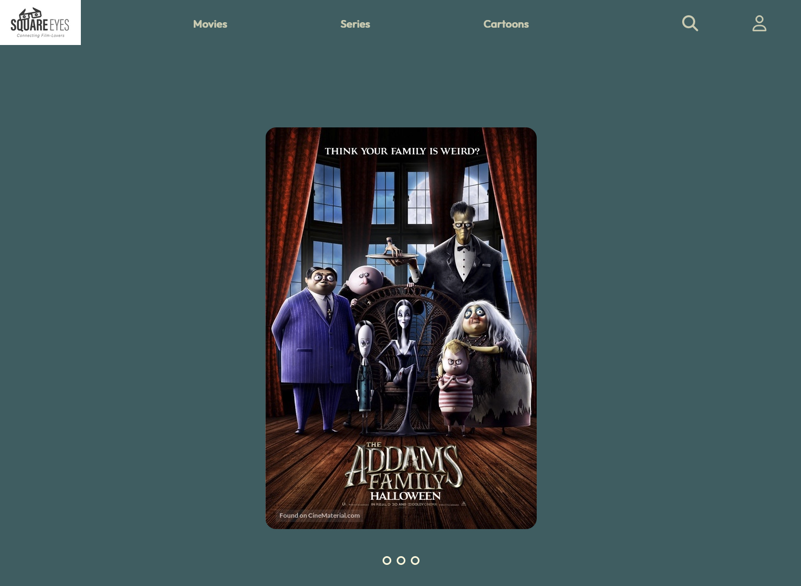

# Square Eyes

## Connecting Film-Lovers



This is a streaming website created over multiple school assiginments. Where it started as a simple static website created with just HTML and CSS, and later WordPress and JavaScript was added to make the website dynamic. It is a website with different movies, including descriptions and images, hosted in WordPress.

### Notable features

It contains a carousel created with CSS on a home page and content served using WordPress.

## Built with

This website is build with pure HTML, CSS and JavaScript. The movie descriptions are hosted on WordPress in WooCommerce plugin.

## Getting started

Clone this respository.

```
git clone git@github.com:zalacop/square-eyes.git
```

You can run this application using your favourite server.

### Prerequsites

Set up a WordPress and install WooCommerce plugin. Then add new products to the WooCommerce plugin. Each product needs a title, description and an image, tag some as featured.

In WooCommerce > Settings > Advanced > REST API > Add key.

You need to change `host` and `REST API key`.
